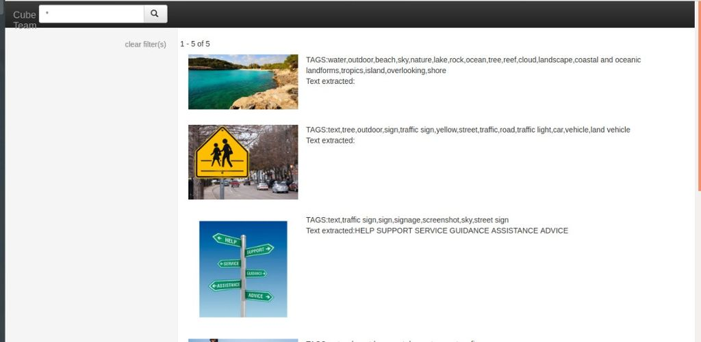

# SIH-Hack
problem statement : Field analysis and automated feature validation from croud sourced field photos

# our HTML File out put

# we can search the keyword from the annotations and extract the data from unstructed database

# presently 5 photos were tested 
